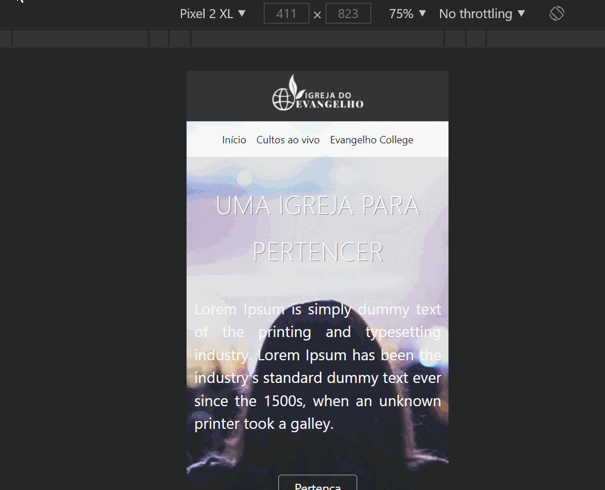

# Site Igreja do Evangelho - Bootstrap

### - Após finalizar o módulo de Bootstrap do curso Programador BR, decidi refazer o primeiro site que criei quando comecei o curso, em fevereiro de 2021. Ao abrir o projeto, me surpreendi com a evolução que eu tive. Até 2 meses atrás eu não conseguia desenvolver quase nada. Hoje, além de prestar manutenção e incluir o Bootstrap em um projeto que já existia, estou conseguindo fazer sistemas mais completos (exemplo disso é o meu sistema Escola do Lucas: se não conhece, veja meus posts do LinkedIn ou acesse https://escoladolucas.netlify.app/).

### - Estou muito feliz com a minha evolução e creio que, em breve, conseguirei minha primeira vaga como Dev Web. Desistir jamais! Hehe :D

### - Nesta aplicação foram usadas as seguintes tecnologias:

#### *HTML.
#### *CSS.
#### *Bootstrap.

### Front End para desktop

### Front End para celular

### Acesse o site e veja você mesmo! Link: https://idevangelhobootstrap.netlify.app/
### Site antigo: https://idevangelho.netlify.app/

### Repositório do projeto: https://github.com/lucasmetron/igrejaDoEvangelhoBootstrap

### Gostou do meu projeto? :D Entre em contato comigo! 
[Linkedin](https://www.linkedin.com/in/lucas-rosa-058683102/)  
[Email: lucasmetron@gmail.com](mailto:lucasmetron@gmail.com)

